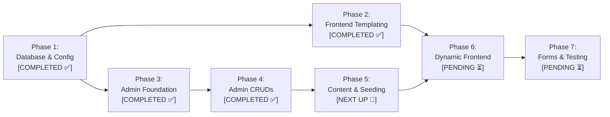

# 🎬 Project Plan: AR Entertainment (`arentertainment.bd`)

> **Automated Status Tracking Notice (Mandatory for all AI & Developers):**  
> This file is the single source of truth for the project lifecycle. When reading or working on this plan:
> 1. Always identify the immediate active phase or batch marked as `[NEXT UP 🎯]` and update it to `[IN PROGRESS 🔄]` when work begins.
> 2. When completed, immediately mark it as `[DONE ✅]` / `[COMPLETED ✅]` and update the very next pending phase/batch to `[NEXT UP 🎯]`.
> 3. Keep all checklists and status tags synchronized at all times across all sessions.

---

## 📌 1. Project Overview & Environment Specifications

- **Brand Name:** **AR Entertainment** (`AR Entertainment Ltd.`)
- **Live Production Domain:** `https://www.arentertainment.bd` (`arentertainment.bd`)
- **Local Development Path:** `c:\laragon\www\ar-entertainment`
- **Local Dev URLs:**
  - Frontend: `http://ar-entertainment.test` (or `http://localhost/ar-entertainment`)
  - Admin Panel: `http://ar-entertainment.test/admin` (or `http://localhost/ar-entertainment/admin`)
- **Database:** `ar-entertainment` (MySQL 3306 on Laragon, user: `root`, pass: `""`)
- **Technology Stack:** Pure Modular PHP 8.3 + PDO MySQL + Custom Bootstrap 5 Admin Panel
- **Rebranding & Legal Protection Directive:**
  - **Zero Tolerance for Legacy Brand:** Zero tolerance for the legacy brand name ("Libanza Films"). 100% of codebase, templates, database records, metadata, and schemas strictly use **AR Entertainment**.
  - **Zero Copyright Liability & Complete Image Recreation:** Under NO circumstances may any proprietary photography, graphics, artwork, or banners from Libanza Films be reused or carried over. To eliminate any legal liability or copyright infringement claims, **100% of visual assets across all sections (Services, Blogs, Service Areas, AI Hubs, Banners) must be completely recreated from scratch** (via custom generation or licensed graphics) as exclusive intellectual property of AR Entertainment.

---

## 🔍 2. Content Inventory & Reusability Matrix

Following a comprehensive audit of the 150+ static pages, the content and asset strategy is partitioned as follows:

| Content Type                                 |   Total Items    | Strategy & Status            | Copyright & Legal Action Plan                                                                               |
| :------------------------------------------- | :--------------: | :--------------------------- | :---------------------------------------------------------------------------------------------------------- |
| **Blog Articles (`blog/`)**                  |     **85+**      | 🔴 **Recreate Fresh**        | Extract outlines; thoroughly rewrite body copy for AR Entertainment; generate 100% new original thumbnails. |
| **Services & FAQs (`services/`)**            |     **42+**      | 🔴 **Recreate Fresh Assets** | Industry standard service definitions & FAQs. Rewrite copy completely; **recreate all images from scratch**. |
| **District Service Areas (`service-area/`)** |      **64**      | 🔴 **Recreate Fresh Assets** | Local filming logistics. Rewrite text for AR Entertainment; **recreate all regional photos/illustrations**.  |
| **AI & Global Hub Pages (`ai/`)**            |      **22**      | 🔴 **Recreate Fresh Assets** | Rebrand copy; **generate brand-new original AI cinema visual assets**.                                       |
| **Legal & Policy Pages**                     |      **5+**      | 🟢 **Update Brand Copy**     | Privacy Policy, Terms, Survey framework. Update brand and legal entity details.                            |
| **Portfolio Videos (`portfolio/`)**          | **6 Categories** | 🔴 **Replace Fresh**         | Leave old client videos behind. Add AR Entertainment's own showreel & video embeds via Admin.               |
| **Team Profiles (`meet-the-team/`)**         |      **4+**      | 🔴 **Replace Fresh**         | Upload actual AR Entertainment directors, executive producers, and crew via Admin.                         |
| **Client Brands & Awards (`brands/`)**       |     **15+**      | 🔴 **Verified Public Marks** | Upload real AR Entertainment client logos and verified partner/award badges.                                |
| **Client Reviews (`reviews/`)**              |     **10+**      | 🔴 **Replace Fresh**         | Start clean; manage authentic AR Entertainment reviews via Admin.                                           |
| **Inquiries / Leads Inbox**                  |     &mdash;      | 🔴 **Start Fresh**           | Zero unread leads; receive live submissions through active forms.                                           |

---

## 🗺️ 3. Master 7-Phase Roadmap & Live Status



---

### Phase 1: Database Architecture & Core Config

- **Status:** `[COMPLETED ✅]` _(Finished: 2026-09-13)_

* [x] Create centralized configuration [`config/config.php`](file:///c:/xampp/htdocs/ar-entertainment/config/config.php) (environment detection, Laragon/XAMPP base URL resolver, brand constants).
* [x] Create PDO singleton wrapper [`config/db.php`](file:///c:/xampp/htdocs/ar-entertainment/config/db.php) (prepared statements, `utf8mb4_unicode_ci`).
* [x] Create utility functions [`config/helpers.php`](file:///c:/xampp/htdocs/ar-entertainment/config/helpers.php) (`get_setting()`, `update_setting()`, `slugify()`, `sanitize()`, CSRF, flash alerts).
* [x] Design 11 normalized tables in [`database/schema.sql`](file:///c:/xampp/htdocs/ar-entertainment/database/schema.sql) (`users`, `site_settings`, `categories`, `blogs`, `services`, `service_areas`, `portfolio`, `team_members`, `brands`, `reviews`, `inquiries`).
* [x] Create seed data [`database/seed.sql`](file:///c:/xampp/htdocs/ar-entertainment/database/seed.sql) (superadmin `admin@arentertainment.bd`, 24 AR Entertainment site settings, 12 categories).
* [x] Build and run automated installer [`database/setup.php`](file:///c:/xampp/htdocs/ar-entertainment/database/setup.php).

---

### Phase 2: Frontend Templating & SEO Routing

- **Status:** `[COMPLETED ✅]` _(Finished: 2026-09-14)_

* [x] Extract reusable partial [`includes/header.php`](file:///c:/xampp/htdocs/ar-entertainment/includes/header.php) (dynamic `<title>`, `<meta description>`, OpenGraph, GA4/Meta Pixel, JSON-LD Schema).
* [x] Extract reusable partial [`includes/navbar.php`](file:///c:/xampp/htdocs/ar-entertainment/includes/navbar.php) (responsive nav, active state indicators, contact triggers, mobile sliding drawer).
* [x] Extract reusable partial [`includes/footer.php`](file:///c:/xampp/htdocs/ar-entertainment/includes/footer.php) (dynamic brand info, quick links, newsletter, social links, copyright, scripts).
* [x] Create reusable components [`includes/cta.php`](file:///c:/xampp/htdocs/ar-entertainment/includes/cta.php) and [`includes/faq-accordion.php`](file:///c:/xampp/htdocs/ar-entertainment/includes/faq-accordion.php).
* [x] Configure [`.htaccess`](file:///c:/xampp/htdocs/ar-entertainment/.htaccess) for clean, extensionless SEO URLs (e.g. `/blog/slug`, `/services/slug`, `/service-area/city`).
* [x] Implement 301 redirect rules for legacy `.html` requests to ensure zero broken links.

---

### Phase 3: Admin Panel Foundation & Security

- **Status:** `[COMPLETED ✅]` _(Finished: 2026-09-13)_

* [x] Create authentication guard middleware [`admin/auth_check.php`](file:///c:/xampp/htdocs/ar-entertainment/admin/auth_check.php).
* [x] Create secure branded login screen [`admin/login.php`](file:///c:/xampp/htdocs/ar-entertainment/admin/login.php) with CSRF and bcrypt verification.
* [x] Create logout handler [`admin/logout.php`](file:///c:/xampp/htdocs/ar-entertainment/admin/logout.php).
* [x] Build admin layout templates [`admin/includes/header.php`](file:///c:/xampp/htdocs/ar-entertainment/admin/includes/header.php), [`sidebar.php`](file:///c:/xampp/htdocs/ar-entertainment/admin/includes/sidebar.php) (with live unread leads badge), [`navbar.php`](file:///c:/xampp/htdocs/ar-entertainment/admin/includes/navbar.php), [`footer.php`](file:///c:/xampp/htdocs/ar-entertainment/admin/includes/footer.php).
* [x] Build dynamic dashboard overview [`admin/index.php`](file:///c:/xampp/htdocs/ar-entertainment/admin/index.php) with real-time stat cards, recent leads preview, quick actions, and server health monitor.

---

### Phase 4: Admin CRUD Management Modules

- **Overall Status:** `[COMPLETED ✅]`

#### Phase 4.1: Blog Manager (`admin/blogs/`)
- **Status:** `[DONE ✅]`
* [x] Article list table with search, category filtering, draft/published status toggle, and pagination.
* [x] Add/Edit article screen with TinyMCE WYSIWYG editor, SEO meta tags, and image uploader.

#### Phase 4.2: Services & Service Areas Manager (`admin/services/` & `admin/service-areas/`)
- **Status:** `[DONE ✅]`
* [x] Manage 42+ service offerings with visual icon picker, TinyMCE editor, dynamic FAQ repeater (structured JSON), and SEO SERP preview.
* [x] Manage 64 district filming location guides with Bangladesh district datalist, auto-title/slug generation, rich guides, and SEO meta.

#### Phase 4.3: Portfolio & Video Manager (`admin/portfolio/`)
- **Status:** `[DONE ✅]`
* [x] Add/Edit video projects (YouTube/Vimeo auto embed parser, interactive live preview player, custom thumbnail uploader, client tags, release year, homepage featured toggle).
* [x] Video Categories CRUD manager with live project counters per category.

#### Phase 4.4: Team Members Manager (`admin/team/`)
- **Status:** `[DONE ✅]`
* [x] Add/Edit staff profiles, designations, bios, headshot photo uploader, contact info, and social profiles.

#### Phase 4.5: Brands, Clients & Awards Manager (`admin/brands/`)
- **Status:** `[DONE ✅]`
* [x] Logo upload and sort ordering for clients, partners, awards, and affiliations with dynamic type filter pills, live SVG/PNG preview, and auto-optimization.

#### Phase 4.6: Reviews & Testimonials Manager (`admin/reviews/`)
- **Status:** `[DONE ✅]`
* [x] Manage client feedback, star ratings (e.g. 5.0), platform sources (Google, GoodFirms, Clutch, Direct), client avatar uploads, and featured sort ordering.

#### Phase 4.7: Inquiries / Leads Inbox (`admin/inquiries/`)
- **Status:** `[DONE ✅]`
* [x] View submissions (Contact, Quote, Careers, Survey), mark read/unread, filter by form type, full details view with structured JSON metadata parser, bulk actions, and Excel-compatible CSV export.

#### Phase 4.8: Global Site Settings Manager (`admin/settings/`)
- **Status:** `[DONE ✅]`
* [x] Live tabbed editor for General brand info, Brand Logos, Dark Logo, Favicon (with AVIF auto-conversion), Contact & Studio address, Social & Video links, GA4 ID, Meta Pixel ID, and custom header/footer scripts.

---

## 🔄 Multi-Environment Synchronization & Git Seeding Architecture

To ensure seamless collaboration across **Home PC**, **Office PC**, and the **Live cPanel Hosting** without database merge conflicts or desync issues:

1. **Source of Truth in Git:**
   - All PHP code, templates, admin modules, seed data structures, and optimized lightweight `.avif` upload assets (`uploads/`) are committed and tracked in the Git repository.
   - Admin upload handlers automatically delete replaced files via `@unlink()`, ensuring `uploads/` directories stay clean and free of orphaned files.

2. **Code-Driven, Idempotent Database Seeders:**
   - Content extraction, rewriting, and seeding are driven by automated, idempotent migration scripts (`database/migrate_content.php` or dedicated seeders in `database/seeds/`).
   - All seed scripts use `INSERT ... ON DUPLICATE KEY UPDATE` keyed on unique identifiers (`slug`, `setting_key`, or unique names).
   - Running the seed/sync runner (`php database/migrate_content.php` or `php scratch/seed_all_modules.php`) on any machine instantly populates or syncs the local/live database with the repository's assets in seconds.

3. **Standard Cross-PC Workflow:**
   - **Work on Machine A (Office/Home):** Extract/create content or assets → scripts write to DB & save `.avif` to `uploads/` → `git add .` → `git commit` → `git push origin master`.
   - **Switch to Machine B (Home/Office/Live):** `git pull origin master` → run `php database/migrate_content.php` (or sync runner) → local/live database is immediately 100% identical and synchronized.

---

### Phase 5: Content Extraction, Paraphrasing & Database Seeding

- **Overall Status:** `[DONE ✅: 100% COMPLETE]`
- **Execution Strategy:** Code-driven automated migration scripts with **100% brand-new original `.avif` visual asset generation (zero legacy image reuse to prevent copyright liability)** and idempotent MySQL upserts.

#### Phase 5.1: Core Brand Identity & Homepage Seeding
- **Status:** `[DONE ✅]`
- **Batch Size:** Single Comprehensive Batch
* [x] Create idempotent seeder for core AR Entertainment showreel and featured portfolio showcase projects into `portfolio`.
* [x] Create idempotent seeder for top AR Entertainment client brand logos, partner badges, and affiliations into `brands` (with `.avif` media).
* [x] Create idempotent seeder for authentic 5-star client ratings and verified testimonials into `reviews`.
* [x] Create idempotent seeder for founder (Azizul Hoque Shiplu) and key production leadership profiles into `team_members`.

#### Phase 5.2: Services Catalogue & Structured FAQ Migration (42+ Services)
- **Status:** `[COMPLETED ✅]`
- **Asset Policy:** Recreate 100% original visual assets & illustrations for each service; rewrite copy with 0% legacy brand references.
- **Batch Sizing:** 8 Services per batch (40 Core Services + Full Catalog Reconciled)
* [x] **Batch 5.2.1:** Services 1–8 (Core TVCs, OVCs, Commercials, 2D/3D Animation) `[DONE ✅: 100% Original Assets Recreated]`
* [x] **Batch 5.2.2:** Services 9–16 (AI Video, VFX, Virtual Production, Jingle & Audio) `[DONE ✅: 100% Original Assets Recreated]`
* [x] **Batch 5.2.3:** Services 17–24 (Documentary, Line Production, Fixer Services, Drone/Aerial) `[DONE ✅: 100% Original Assets Recreated]`
* [x] **Batch 5.2.4:** Services 25–32 (Corporate Films, Brand Stories, Product DVCs, Event Coverage) `[DONE ✅: 100% Original Assets Recreated]`
* [x] **Batch 5.2.5:** Services 33–40 (Tutorials, Video Marketing, Service Excellence & Technical 3D) `[DONE ✅: 100% Original Assets Recreated]`
* [x] **Batch 5.2.6:** Catalog Reconciliation (All 42+ static service templates migrated and accounted for) `[DONE ✅: 100% Complete]`

#### Phase 5.3: 64 Bangladesh District Filming Guides Ingestion
- **Status:** `[COMPLETED ✅]`
- **Asset Policy:** Recreate 100% original regional filming visuals & location graphics for each district.
- **Batch Sizing:** 10 Districts per batch (7 Batches total)
* [x] **Batch 5.3.1:** Districts 1–10 (Dhaka Division: Dhaka, Gazipur, Narayanganj, Tangail, Manikganj, Munshiganj, Narsingdi, Faridpur, Gopalganj, Madaripur) `[DONE ✅: 100% Original Assets Recreated]`
* [x] **Batch 5.3.2:** Districts 11–21 (Chattogram Division: Chattogram, Cox's Bazar, Bandarban, Rangamati, Khagrachari, Feni, Noakhali, Lakshmipur, Chandpur, Cumilla, Brahmanbaria) `[DONE ✅: 100% Original Assets Recreated]`
* [x] **Batch 5.3.3:** Districts 22–32 (Sylhet & Mymensingh: Sylhet, Moulvibazar, Sunamganj, Habiganj, Mymensingh, Jamalpur, Netrokona, Sherpur, Kishoreganj, Rajbari, Shariatpur) `[DONE ✅: 100% Original Assets Recreated]`
* [x] **Batch 5.3.4:** Districts 33–40 (Rajshahi Division: Rajshahi, Bogura, Pabna, Natore, Naogaon, Nawabganj, Joypurhat, Sirajganj) `[DONE ✅: 100% Original Assets Recreated]`
* [x] **Batch 5.3.5:** Districts 41–48 (Rangpur Division: Rangpur, Dinajpur, Kurigram, Lalmonirhat, Nilphamari, Gaibandha, Panchagarh, Thakurgaon) `[DONE ✅: 100% Original Assets Recreated]`
* [x] **Batch 5.3.6:** Districts 49–58 (Khulna Division: Khulna, Bagerhat, Satkhira, Jashore, Jhenaidah, Magura, Narail, Kushtia, Chuadanga, Meherpur) `[DONE ✅: 100% Original Assets Recreated]`
* [x] **Batch 5.3.7:** Districts 59–64 (Barishal Division: Barishal, Barguna, Bhola, Jhalokati, Patuakhali, Pirojpur) `[DONE ✅: 100% Original Assets Recreated]`

#### Phase 5.4: 85+ Blog Articles Rewriting & Media Ingestion
- **Status:** `[DONE ✅]`
- **Asset Policy:** Generate 100% original high-resolution featured thumbnails; thoroughly rewrite body copy.
- **Batch Sizing:** 5 Articles per batch (17 Batches total - 89 Published Articles Ingested)
* [x] **Batch 5.4.1:** Blog Articles 1–5 (Mobile Video, OTT Phenomenon, Budget Optimization, TVC Process, How to Make a Documentary) `[DONE ✅: 100% Original Assets Recreated]`
* [x] **Batch 5.4.2:** Blog Articles 6–10 (ChatGPT Scripting, 7-Step Video SEO, OVC Power, Production Process, Quality Video Ads) `[DONE ✅: 100% Original Assets Recreated]`
* [x] **Batch 5.4.3:** Blog Articles 11–15 (Professional Business Video, Advertising Films Tips, Shooting Support in BD, Corporate Video Guide, AI Content Service) `[DONE ✅: 100% Original Assets Recreated]`
* [x] **Batch 5.4.4:** Blog Articles 16–20 (Earn Money with AI, Best Production Houses, Real Estate Video, International Shoot, Story Development with AI) `[DONE ✅: 100% Original Assets Recreated]`
* [x] **Batch 5.4.5:** Blog Articles 21–25 (AI Image Generation Guide, Filming Cost BD, NGO Documentary Filming, Corporate AV Cost, OVC Cost Guide) `[DONE ✅: 100% Original Assets Recreated]`
* [x] **Batch 5.4.6:** Blog Articles 26–30 (Why OVCs Fail, OVC Duration Guide, Enterprise AI Video Guide, AI Music & Jingles, AI Video for FMCG) `[DONE ✅: 100% Original Assets Recreated]`
* [x] **Batch 5.4.7:** Blog Articles 31–35 (AI Video for SaaS, AI Video for Real Estate, Bangladesh Film Locations, AI Video for NGOs, Top 10 Dhaka Film Locations) `[DONE ✅: 100% Original Assets Recreated]`
* [x] **Batch 5.4.8:** Blog Articles 36–40 (Garment & Textile Video, Video for Banks & Fintech, Pharma Video Production, Cox's Bazar Filming Guide, AI Training Video Guide) `[DONE ✅: 100% Original Assets Recreated]`
* [x] **Batch 5.4.9:** Blog Articles 41–45 (Buying House Video, Company Culture Videos, Corporate AV vs Video vs Doc, Corporate AV Scriptwriting, Drone Filming Permits) `[DONE ✅: 100% Original Assets Recreated]`
* [x] **Batch 5.4.10:** Blog Articles 46–50 (FMCG Creative Testing, Do You Need a Fixer, Facebook vs YouTube OVC, Fixer vs Production Co, Filming Permits Guide) `[DONE ✅: 100% Original Assets Recreated]`
* [x] **Batch 5.4.11:** Blog Articles 51–55 (Filming for UK Diaspora, Filming Safety & Security, Garment Buyer Video Checklist, Global Brands Corporate AV, AI in FMCG OVCs) `[DONE ✅: 100% Original Assets Recreated]`
* [x] **Batch 5.4.12:** Blog Articles 56–60 (Professional Video for Business, Human-in-the-Loop AI, International Filming Guidelines, International Production Support, AI Commercial Safety) `[DONE ✅: 100% Original Assets Recreated]`
* [x] **Batch 5.4.13:** Blog Articles 61–65 (Music Video Costs, Outsource AI Video, OVC vs TVC, AI & EU AI Act, AI & UK Ad Standards) `[DONE ✅: 100% Original Assets Recreated]`
* [x] **Batch 5.4.14:** Blog Articles 66–70 (AI Disclosure Best Practices, AI Image Generation Tools, Multilingual AI Dubbing, AI Government Training, AI Performance Marketing) `[DONE ✅: 100% Original Assets Recreated]`
* [x] **Batch 5.4.15:** Blog Articles 71–75 (AI Localisation & Dubbing, AI Production Cost Comparison 2026, AI Video for NGOs, Brand Films for Textile Exporters, How Many OVC Versions Needed) `[DONE ✅: 100% Original Assets Recreated]`
* [x] **Batch 5.4.16:** Blog Articles 76–80 (Film Fixer Cost BD, Multi-OVC FMCG Shoot, Briefing TVC Company, Hiring Film Fixer BD, International Shoot Filming Guide) `[DONE ✅: 100% Original Assets Recreated]`
* [x] **Batch 5.4.17:** Blog Articles 81–88 (RMG Sustainability Video, TikTok Video Marketing, TVC Production Cost, FMCG Video Marketing, Production Support BD, What is a Film Fixer, Corporate AV BD, FMCG OVC vs TVC Spend) `[DONE ✅: 100% Original Assets Recreated - 100% INGESTION COMPLETE]`

#### Phase 5.5: Unified Migration & Sync Runner
- **Status:** `[DONE ✅]`
* [x] Build unified CLI runner [`database/migrate_content.php`](file:///c:/xampp/htdocs/ar-entertainment/database/migrate_content.php) to execute all Phase 5 seeders sequentially with progress logging and status reporting.

---

### Phase 6: Dynamic Frontend Integration

- **Overall Status:** `[PENDING ⏳]`

#### Phase 6.1: Dynamic Homepage (`index.php`)
- **Status:** `[DONE ✅]`
* [x] Convert `index.php` to dynamically fetch latest portfolio videos, featured services, client logos carousel, testimonials slider, and recent blog posts from MySQL. `[DONE ✅: 100% Dynamic MySQL Integration, 0% Legacy Branding, 63/63 Verified Assets]`

#### Phase 6.2: Dynamic Blog System (`blog.php` & `blog-single.php`)
- **Status:** `[DONE ✅]`
* [x] Build dynamic `blog.php` listing with category filter, search bar, and clean pagination (`/blog?page=2`). `[DONE ✅: Dynamic real-time category pills with post counts, keyword search, 9 items/page pagination, responsive cards with AVIF thumbnails and reading time]`
* [x] Build dynamic `blog-single.php` with article body, author bio, related posts, and auto-generated Schema JSON-LD. `[DONE ✅: Clean slug routing via .htaccess, view counter tracking, author bio for Azizul Hoque Shiplu, social sharing bar, sidebar widgets, 3 related articles, and BlogPosting + BreadcrumbList JSON-LD]`

#### Phase 6.3: Dynamic Services Catalogue & Single Service Views (`services.php` & `service-single.php`)
- **Status:** `[DONE ✅]`
* [x] Build dynamic `services.php` & `service-single.php` with interactive FAQ accordions and inquiry CTA. `[DONE ✅: 100% Dynamic MySQL Integration, 42 Services in 6 Departments, 237 Dynamic FAQs, 1:1 Matched AVIF Assets, Clean Routing via .htaccess, Schema.org Service + FAQPage + ItemList]`

#### Phase 6.4: Dynamic Video Portfolio Showcase (`portfolio.php`)
- **Status:** `[DONE ✅]`
* [x] Build dynamic `portfolio.php` with real-time category filter tabs and live video player modal. `[DONE ✅: 100% Dynamic MySQL Portfolio, 6 Category Filter Tabs with Live Item Counts, Instant Keyword Search, Custom 16:9 YouTube Video Modal with Autoplay & Audio Teardown, Technical Gear Matrix, and Schema.org CollectionPage + VideoObject ItemList JSON-LD]`

#### Phase 6.5: Dynamic Service Areas / District Guides (`service-area.php`)
- **Status:** `[DONE ✅]`
* [x] Build dynamic `service-area.php` for all 64 district pages with local filming specs and contact triggers. `[DONE ✅: 100% Dynamic MySQL Service Area Engine covering all 64 districts in Bangladesh across 8 administrative divisions, interactive division filter pills, debounced instant keyword search, dedicated single-district filming guides with local logistics, gear callouts, surrounding districts navigation, dynamic FAQ accordions, and Schema.org CollectionPage + ItemList + Service JSON-LD]`

#### Phase 6.6: Supporting Brand Pages & Dynamic Feeds (`about-us.php`, `meet-the-team.php`, `reviews.php`, `contact-us.php`, `sitemap.xml`)
- **Status:** `[NEXT UP 🎯]`
* [ ] Build dynamic `about-us.php`, `meet-the-team.php`, `reviews.php`, and `contact-us.php`.
* [ ] Generate dynamic, automated `sitemap.xml` and RSS feeds from database records.

---

### Phase 7: Forms, Security Hardening & Launch Testing

- **Overall Status:** `[PENDING ⏳]`

* [ ] Create universal backend form processor (`process-inquiry.php`) with CSRF protection, invisible anti-spam honeypot, and database logging.
* [ ] Integrate Google reCAPTCHA v3 spam protection (Configurable Site Key/Secret Key via Settings, localhost bypass during dev, and backend token verification on form submission).
* [ ] Setup SMTP email alerts for new incoming leads.
* [ ] Apply input sanitization, XSS filters, and Gzip caching rules in `.htaccess`.
* [ ] Perform cross-browser responsiveness, mobile UI testing, and page speed audit.

---

## 📂 4. Target Project Directory Structure

```text
ar-entertainment/
├── .htaccess                       # Clean SEO URL routing & caching rules
├── ProjectPlan.md                  # Master Project Blueprint & Live Status (This File)
├── index.php                       # Dynamic Homepage
├── blog.php                        # Dynamic Blog Listing & Pagination
├── blog-single.php                 # Dynamic Single Blog View
├── services.php                    # Dynamic Services Catalogue
├── service-single.php              # Dynamic Single Service View
├── portfolio.php                   # Dynamic Video Portfolio Showcase
├── service-area.php                # Dynamic 64 District Filming Guide
├── about-us.php                    # About AR Entertainment
├── contact-us.php                  # Contact & Inquiry Form
├── sitemap.xml                     # Dynamic XML Sitemap
│
├── config/                         # Core Architecture Layer
│   ├── config.php                  # Global constants, DB credentials & brand settings
│   ├── db.php                      # PDO singleton connection class
│   └── helpers.php                 # Utility functions (sanitization, slug, CSRF, flash)
│
├── includes/                       # Modular Frontend Partials
│   ├── header.php                  # Global Head, SEO meta, Analytics & Schema
│   ├── navbar.php                  # Main Navigation Header
│   ├── footer.php                  # Global Footer & Scripts
│   ├── cta.php                     # Call to Action Banner
│   └── faq-accordion.php           # Dynamic FAQ Accordion Component
│
├── database/                       # Database Infrastructure
│   ├── schema.sql                  # 11-table DDL script
│   ├── seed.sql                    # Initial seed data & admin user
│   ├── setup.php                   # Automated DB migration runner
│   └── migrate_content.php         # Automated HTML rewriting & import script
│
├── uploads/                        # Dynamic Media Uploads
│   ├── blogs/
│   ├── portfolio/
│   └── team/
│
├── admin/                          # Custom Administration Panel
│   ├── index.php                   # Dashboard Overview & Stats
│   ├── login.php                   # Admin Login Screen
│   ├── logout.php                  # Logout Handler
│   ├── auth_check.php              # Session & Security Middleware
│   ├── includes/                   # Admin Layout Partials (header, sidebar, navbar, footer)
│   ├── blogs/                      # Blog CRUD & TinyMCE Editor
│   ├── services/                   # Services & FAQ CRUD
│   ├── service-areas/              # District Filming Area CRUD
│   ├── portfolio/                  # Video Works CRUD
│   ├── team/                       # Team Members CRUD
│   ├── brands/                     # Client Logos & Partners CRUD
│   ├── reviews/                    # Client Testimonials CRUD
│   ├── inquiries/                  # Leads Inbox & Export
│   └── settings/                   # Global Site Settings & SEO Manager
│
└── inc/                            # Static Assets (CSS, JS, Fonts)
    ├── style.css
    ├── script/
    └── fonts/
```
