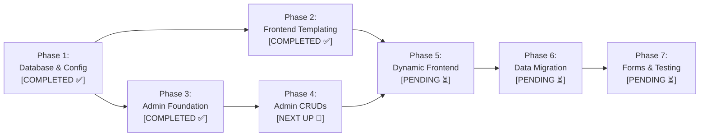

# 🎬 Project Plan: AR Entertainment (`arentertainment.bd`)

> **Automated Status Tracking Notice:**  
> This file is the single source of truth for the project lifecycle. Whenever any phase, feature, or task is worked on and completed in subsequent sessions, its status and checklist in this document **must be automatically updated** from `[PENDING ⏳]` to `[IN PROGRESS 🔄]` or `[COMPLETED ✅]`.

---

## 📌 1. Project Overview & Environment Specifications

- **Brand Name:** **AR Entertainment** (`AR Entertainment Ltd.`)
- **Live Production Domain:** `https://www.arentertainment.bd` (`arentertainment.bd`)
- **Local Development Path:** `c:\laragon\www\ar-entertainment`
- **Local Dev URLs:**
  - Frontend: `http://ar-entertainment.test` (or `http://localhost/ar-entertainment`)
  - Admin Panel: `http://ar-entertainment.test/admin` (or `http://localhost/ar-entertainment/admin`)
- **Database:** `ar-entertainment` (MySQL 3306 on Laragon, user: `root`, pass: `""`)
- **Technology Stack:** Pure Modular PHP 8.3 + PDO MySQL + Custom Bootstrap 5 Admin Panel
- **Rebranding Directive:** Zero tolerance for the legacy brand name ("Libanza Films"). 100% of codebase, templates, database records, metadata, and schemas strictly use **AR Entertainment**.

---

## 🔍 2. Content Inventory & Reusability Matrix

Following a comprehensive audit of the 150+ static pages, the content strategy is partitioned as follows:

| Content Type                                 |   Total Items    | Strategy & Status         | Copyright / Action Plan                                                                           |
| :------------------------------------------- | :--------------: | :------------------------ | :------------------------------------------------------------------------------------------------ |
| **Blog Articles (`blog/`)**                  |     **85+**      | 🟢 **Reusable (Rewrite)** | Extract topics/outlines, rewrite body copy uniquely for AR Entertainment, recreate AI thumbnails. |
| **Services & FAQs (`services/`)**            |     **42+**      | 🟢 **Reusable (Rebrand)** | Industry standard service definitions & FAQs. Rebrand headlines, intros & pricing.                |
| **District Service Areas (`service-area/`)** |      **64**      | 🟢 **Reusable (Rebrand)** | Local SEO landing pages for all 64 districts in Bangladesh. Update to AR Entertainment.           |
| **AI & Global Hub Pages (`ai/`)**            |      **22**      | 🟢 **Reusable (Rebrand)** | Global production hub pages (USA, UK, UAE, Canada, etc.). Rebrand copy.                           |
| **Legal & Policy Pages**                     |      **5+**      | 🟢 **Reusable (Update)**  | Privacy Policy, Why Choose Us, Survey framework. Update brand details.                            |
| **Portfolio Videos (`portfolio/`)**          | **6 Categories** | 🔴 **Replace Fresh**      | Leave old client videos behind. Add AR Entertainment's own showreel embeds via Admin.             |
| **Team Profiles (`meet-the-team/`)**         |      **4+**      | 🔴 **Replace Fresh**      | Upload actual AR Entertainment directors, producers, and crew via Admin.                          |
| **Client Brands & Awards (`brands/`)**       |     **15+**      | 🔴 **Replace Fresh**      | Upload real AR Entertainment client logos and partner badges via Admin.                           |
| **Client Reviews (`reviews/`)**              |     **10+**      | 🔴 **Replace Fresh**      | Start clean; manage authentic AR Entertainment reviews via Admin.                                 |
| **Inquiries / Leads Inbox**                  |     &mdash;      | 🔴 **Start Fresh**        | Zero unread leads; receive live submissions through active forms.                                 |

---

## 🗺️ 3. Master 7-Phase Roadmap & Live Status



---

### Phase 1: Database Architecture & Core Config

- **Status:** `[COMPLETED ✅]` _(Finished: 2026-09-13)_

* [x] Create centralized configuration [`config/config.php`](file:///c:/xampp/htdocs/ar-entertainment/config/config.php) (environment detection, Laragon/XAMPP base URL resolver, brand constants).
* [x] Create PDO singleton wrapper [`config/db.php`](file:///c:/xampp/htdocs/ar-entertainment/config/db.php) (prepared statements, `utf8mb4_unicode_ci`).
* [x] Create utility functions [`config/helpers.php`](file:///c:/xampp/htdocs/ar-entertainment/config/helpers.php) (`get_setting()`, `update_setting()`, `slugify()`, `sanitize()`, CSRF, flash alerts).
* [x] Design 11 normalized tables in [`database/schema.sql`](file:///c:/xampp/htdocs/ar-entertainment/database/schema.sql) (`users`, `site_settings`, `categories`, `blogs`, `services`, `service_areas`, `portfolio`, `team_members`, `brands`, `reviews`, `inquiries`).
* [x] Create seed data [`database/seed.sql`](file:///c:/xampp/htdocs/ar-entertainment/database/seed.sql) (superadmin `admin@arentertainment.bd`, 24 AR Entertainment site settings, 12 categories).
* [x] Build and run automated installer [`database/setup.php`](file:///c:/xampp/htdocs/ar-entertainment/database/setup.php).

---

### Phase 2: Frontend Templating & SEO Routing

- **Status:** `[COMPLETED ✅]` _(Finished: 2026-09-14)_

* [x] Extract reusable partial [`includes/header.php`](file:///c:/xampp/htdocs/ar-entertainment/includes/header.php) (dynamic `<title>`, `<meta description>`, OpenGraph, GA4/Meta Pixel, JSON-LD Schema).
* [x] Extract reusable partial [`includes/navbar.php`](file:///c:/xampp/htdocs/ar-entertainment/includes/navbar.php) (responsive nav, active state indicators, contact triggers, mobile sliding drawer).
* [x] Extract reusable partial [`includes/footer.php`](file:///c:/xampp/htdocs/ar-entertainment/includes/footer.php) (dynamic brand info, quick links, newsletter, social links, copyright, scripts).
* [x] Create reusable components [`includes/cta.php`](file:///c:/xampp/htdocs/ar-entertainment/includes/cta.php) and [`includes/faq-accordion.php`](file:///c:/xampp/htdocs/ar-entertainment/includes/faq-accordion.php).
* [x] Configure [`.htaccess`](file:///c:/xampp/htdocs/ar-entertainment/.htaccess) for clean, extensionless SEO URLs (e.g. `/blog/slug`, `/services/slug`, `/service-area/city`).
* [x] Implement 301 redirect rules for legacy `.html` requests to ensure zero broken links.

---

### Phase 3: Admin Panel Foundation & Security

- **Status:** `[COMPLETED ✅]` _(Finished: 2026-09-13)_

* [x] Create authentication guard middleware [`admin/auth_check.php`](file:///c:/xampp/htdocs/ar-entertainment/admin/auth_check.php).
* [x] Create secure branded login screen [`admin/login.php`](file:///c:/xampp/htdocs/ar-entertainment/admin/login.php) with CSRF and bcrypt verification.
* [x] Create logout handler [`admin/logout.php`](file:///c:/xampp/htdocs/ar-entertainment/admin/logout.php).
* [x] Build admin layout templates [`admin/includes/header.php`](file:///c:/xampp/htdocs/ar-entertainment/admin/includes/header.php), [`sidebar.php`](file:///c:/xampp/htdocs/ar-entertainment/admin/includes/sidebar.php) (with live unread leads badge), [`navbar.php`](file:///c:/xampp/htdocs/ar-entertainment/admin/includes/navbar.php), [`footer.php`](file:///c:/xampp/htdocs/ar-entertainment/admin/includes/footer.php).
* [x] Build dynamic dashboard overview [`admin/index.php`](file:///c:/xampp/htdocs/ar-entertainment/admin/index.php) with real-time stat cards, recent leads preview, quick actions, and server health monitor.

---

### Phase 4: Admin CRUD Management Modules

- **Overall Status:** `[IN PROGRESS 🔄]`

#### Phase 4.1: Blog Manager (`admin/blogs/`)
- **Status:** `[DONE ✅]`
* [x] Article list table with search, category filtering, draft/published status toggle, and pagination.
* [x] Add/Edit article screen with TinyMCE WYSIWYG editor, SEO meta tags, and image uploader.

#### Phase 4.2: Services & Service Areas Manager (`admin/services/` & `admin/service-areas/`)
- **Status:** `[DONE ✅]`
* [x] Manage 42+ service offerings with visual icon picker, TinyMCE editor, dynamic FAQ repeater (structured JSON), and SEO SERP preview.
* [x] Manage 64 district filming location guides with Bangladesh district datalist, auto-title/slug generation, rich guides, and SEO meta.

#### Phase 4.3: Portfolio & Video Manager (`admin/portfolio/`)
- **Status:** `[DONE ✅]`
* [x] Add/Edit video projects (YouTube/Vimeo auto embed parser, interactive live preview player, custom thumbnail uploader, client tags, release year, homepage featured toggle).
* [x] Video Categories CRUD manager with live project counters per category.

#### Phase 4.4: Team Members Manager (`admin/team/`)
- **Status:** `[DONE ✅]`
* [x] Add/Edit staff profiles, designations, bios, headshot photo uploader, contact info, and social profiles.

#### Phase 4.5: Brands, Clients & Awards Manager (`admin/brands/`)
- **Status:** `[NEXT UP 🎯]`
* [ ] Logo upload and sort ordering for clients, partners, and awards.

#### Phase 4.6: Reviews & Testimonials Manager (`admin/reviews/`)
- **Status:** `[PENDING ⏳]`
* [ ] Manage client feedback, star ratings (e.g. 5.0), and featured flags.

#### Phase 4.7: Inquiries / Leads Inbox (`admin/inquiries/`)
- **Status:** `[PENDING ⏳]`
* [ ] View submissions (Contact, Quote, Careers, Survey), mark read/unread, filter by form type, CSV export.

#### Phase 4.8: Global Site Settings Manager (`admin/settings/`)
- **Status:** `[PENDING ⏳]`
* [ ] Live editor for phone, email, office address, social links, GA4 ID, Meta Pixel ID, and custom scripts.

---

### Phase 5: Dynamic Frontend Integration

- **Overall Status:** `[PENDING ⏳]`

#### Phase 5.1: Dynamic Homepage (`index.php`)
- **Status:** `[PENDING ⏳]`
* [ ] Convert `index.php` to dynamically fetch latest portfolio videos, featured services, client logos, testimonials, and recent blog posts.

#### Phase 5.2: Dynamic Blog System (`blog.php` & `blog-single.php`)
- **Status:** `[PENDING ⏳]`
* [ ] Build dynamic `blog.php` listing with category filter, search bar, and clean pagination (`/blog?page=2`).
* [ ] Build dynamic `blog-single.php` with article body, author info, related posts, and auto-generated Schema JSON-LD.

#### Phase 5.3: Dynamic Services Catalogue & Single Service Views (`services.php` & `service-single.php`)
- **Status:** `[PENDING ⏳]`
* [ ] Build dynamic `services.php` & `service-single.php` with interactive FAQ accordions.

#### Phase 5.4: Dynamic Video Portfolio Showcase (`portfolio.php`)
- **Status:** `[PENDING ⏳]`
* [ ] Build dynamic `portfolio.php` with real-time category filter tabs.

#### Phase 5.5: Dynamic Service Areas / District Guides (`service-area.php`)
- **Status:** `[PENDING ⏳]`
* [ ] Build dynamic `service-area.php` for all 64 district pages.

#### Phase 5.6: Supporting Brand Pages (`about-us.php`, `meet-the-team.php`, `reviews.php`, `contact-us.php`)
- **Status:** `[PENDING ⏳]`
* [ ] Build `about-us.php`, `meet-the-team.php`, `reviews.php`, `contact-us.php`.

---

### Phase 6: Data Rewriting, Migration & SEO Continuity

- **Overall Status:** `[PENDING ⏳]`

#### Phase 6.1: Content Migration Automation Script (`database/migrate_content.php`)
- **Status:** `[PENDING ⏳]`
* [ ] Build automated parser script (`database/migrate_content.php`).

#### Phase 6.2: Blog Articles Rewriting & Media Ingestion
- **Status:** `[PENDING ⏳]`
* [ ] Extract and rewrite all 85+ blog articles with fresh phrasing, customized for AR Entertainment.
* [ ] Generate and attach new AI featured images for all blog posts.

#### Phase 6.3: Services & District Data Ingestion
- **Status:** `[PENDING ⏳]`
* [ ] Migrate 42+ service descriptions and FAQ datasets into MySQL.
* [ ] Migrate 64 district filming guides into MySQL.

#### Phase 6.4: Dynamic XML Sitemap & RSS Feed Generation
- **Status:** `[PENDING ⏳]`
* [ ] Generate dynamic, automated `sitemap.xml` and RSS feeds from database records.

---

### Phase 7: Forms, Security Hardening & Launch Testing

- **Overall Status:** `[PENDING ⏳]`

* [ ] Create universal backend form processor (`process-inquiry.php`) with CSRF protection, invisible anti-spam honeypot, and database logging.
* [ ] Integrate Google reCAPTCHA v3 spam protection (Configurable Site Key/Secret Key via Settings, localhost bypass during dev, and backend token verification on form submission).
* [ ] Setup SMTP email alerts for new incoming leads.
* [ ] Apply input sanitization, XSS filters, and Gzip caching rules in `.htaccess`.
* [ ] Perform cross-browser responsiveness, mobile UI testing, and page speed audit.

---

## 📂 4. Target Project Directory Structure

```text
ar-entertainment/
├── .htaccess                       # Clean SEO URL routing & caching rules
├── ProjectPlan.md                  # Master Project Blueprint & Live Status (This File)
├── index.php                       # Dynamic Homepage
├── blog.php                        # Dynamic Blog Listing & Pagination
├── blog-single.php                 # Dynamic Single Blog View
├── services.php                    # Dynamic Services Catalogue
├── service-single.php              # Dynamic Single Service View
├── portfolio.php                   # Dynamic Video Portfolio Showcase
├── service-area.php                # Dynamic 64 District Filming Guide
├── about-us.php                    # About AR Entertainment
├── contact-us.php                  # Contact & Inquiry Form
├── sitemap.xml                     # Dynamic XML Sitemap
│
├── config/                         # Core Architecture Layer
│   ├── config.php                  # Global constants, DB credentials & brand settings
│   ├── db.php                      # PDO singleton connection class
│   └── helpers.php                 # Utility functions (sanitization, slug, CSRF, flash)
│
├── includes/                       # Modular Frontend Partials
│   ├── header.php                  # Global Head, SEO meta, Analytics & Schema
│   ├── navbar.php                  # Main Navigation Header
│   ├── footer.php                  # Global Footer & Scripts
│   ├── cta.php                     # Call to Action Banner
│   └── faq-accordion.php           # Dynamic FAQ Accordion Component
│
├── database/                       # Database Infrastructure
│   ├── schema.sql                  # 11-table DDL script
│   ├── seed.sql                    # Initial seed data & admin user
│   ├── setup.php                   # Automated DB migration runner
│   └── migrate_content.php         # Automated HTML rewriting & import script
│
├── uploads/                        # Dynamic Media Uploads
│   ├── blogs/
│   ├── portfolio/
│   └── team/
│
├── admin/                          # Custom Administration Panel
│   ├── index.php                   # Dashboard Overview & Stats
│   ├── login.php                   # Admin Login Screen
│   ├── logout.php                  # Logout Handler
│   ├── auth_check.php              # Session & Security Middleware
│   ├── includes/                   # Admin Layout Partials (header, sidebar, navbar, footer)
│   ├── blogs/                      # Blog CRUD & TinyMCE Editor
│   ├── services/                   # Services & FAQ CRUD
│   ├── service-areas/              # District Filming Area CRUD
│   ├── portfolio/                  # Video Works CRUD
│   ├── team/                       # Team Members CRUD
│   ├── brands/                     # Client Logos & Partners CRUD
│   ├── reviews/                    # Client Testimonials CRUD
│   ├── inquiries/                  # Leads Inbox & Export
│   └── settings/                   # Global Site Settings & SEO Manager
│
└── inc/                            # Static Assets (CSS, JS, Fonts)
    ├── style.css
    ├── script/
    └── fonts/
```
