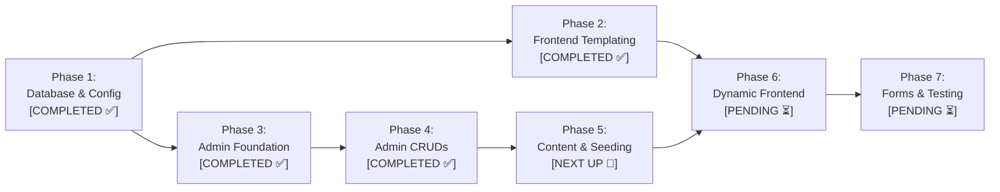

# 🎬 Project Plan: AR Entertainment (`arentertainment.bd`)

> **Automated Status Tracking Notice:**  
> This file is the single source of truth for the project lifecycle. Whenever any phase, feature, or task is worked on and completed in subsequent sessions, its status and checklist in this document **must be automatically updated** from `[PENDING ⏳]` to `[IN PROGRESS 🔄]` or `[COMPLETED ✅]`.

---

## 📌 1. Project Overview & Environment Specifications

- **Brand Name:** **AR Entertainment** (`AR Entertainment Ltd.`)
- **Live Production Domain:** `https://www.arentertainment.bd` (`arentertainment.bd`)
- **Local Development Path:** `c:\laragon\www\ar-entertainment`
- **Local Dev URLs:**
  - Frontend: `http://ar-entertainment.test` (or `http://localhost/ar-entertainment`)
  - Admin Panel: `http://ar-entertainment.test/admin` (or `http://localhost/ar-entertainment/admin`)
- **Database:** `ar-entertainment` (MySQL 3306 on Laragon, user: `root`, pass: `""`)
- **Technology Stack:** Pure Modular PHP 8.3 + PDO MySQL + Custom Bootstrap 5 Admin Panel
- **Rebranding Directive:** Zero tolerance for the legacy brand name ("Libanza Films"). 100% of codebase, templates, database records, metadata, and schemas strictly use **AR Entertainment**.

---

## 🔍 2. Content Inventory & Reusability Matrix

Following a comprehensive audit of the 150+ static pages, the content strategy is partitioned as follows:

| Content Type                                 |   Total Items    | Strategy & Status         | Copyright / Action Plan                                                                           |
| :------------------------------------------- | :--------------: | :------------------------ | :------------------------------------------------------------------------------------------------ |
| **Blog Articles (`blog/`)**                  |     **85+**      | 🟢 **Reusable (Rewrite)** | Extract topics/outlines, rewrite body copy uniquely for AR Entertainment, recreate AI thumbnails. |
| **Services & FAQs (`services/`)**            |     **42+**      | 🟢 **Reusable (Rebrand)** | Industry standard service definitions & FAQs. Rebrand headlines, intros & pricing.                |
| **District Service Areas (`service-area/`)** |      **64**      | 🟢 **Reusable (Rebrand)** | Local SEO landing pages for all 64 districts in Bangladesh. Update to AR Entertainment.           |
| **AI & Global Hub Pages (`ai/`)**            |      **22**      | 🟢 **Reusable (Rebrand)** | Global production hub pages (USA, UK, UAE, Canada, etc.). Rebrand copy.                           |
| **Legal & Policy Pages**                     |      **5+**      | 🟢 **Reusable (Update)**  | Privacy Policy, Why Choose Us, Survey framework. Update brand details.                            |
| **Portfolio Videos (`portfolio/`)**          | **6 Categories** | 🔴 **Replace Fresh**      | Leave old client videos behind. Add AR Entertainment's own showreel embeds via Admin.             |
| **Team Profiles (`meet-the-team/`)**         |      **4+**      | 🔴 **Replace Fresh**      | Upload actual AR Entertainment directors, producers, and crew via Admin.                          |
| **Client Brands & Awards (`brands/`)**       |     **15+**      | 🔴 **Replace Fresh**      | Upload real AR Entertainment client logos and partner badges via Admin.                           |
| **Client Reviews (`reviews/`)**              |     **10+**      | 🔴 **Replace Fresh**      | Start clean; manage authentic AR Entertainment reviews via Admin.                                 |
| **Inquiries / Leads Inbox**                  |     &mdash;      | 🔴 **Start Fresh**        | Zero unread leads; receive live submissions through active forms.                                 |

---

## 🗺️ 3. Master 7-Phase Roadmap & Live Status



---

### Phase 1: Database Architecture & Core Config

- **Status:** `[COMPLETED ✅]` _(Finished: 2026-09-13)_

* [x] Create centralized configuration [`config/config.php`](file:///c:/xampp/htdocs/ar-entertainment/config/config.php) (environment detection, Laragon/XAMPP base URL resolver, brand constants).
* [x] Create PDO singleton wrapper [`config/db.php`](file:///c:/xampp/htdocs/ar-entertainment/config/db.php) (prepared statements, `utf8mb4_unicode_ci`).
* [x] Create utility functions [`config/helpers.php`](file:///c:/xampp/htdocs/ar-entertainment/config/helpers.php) (`get_setting()`, `update_setting()`, `slugify()`, `sanitize()`, CSRF, flash alerts).
* [x] Design 11 normalized tables in [`database/schema.sql`](file:///c:/xampp/htdocs/ar-entertainment/database/schema.sql) (`users`, `site_settings`, `categories`, `blogs`, `services`, `service_areas`, `portfolio`, `team_members`, `brands`, `reviews`, `inquiries`).
* [x] Create seed data [`database/seed.sql`](file:///c:/xampp/htdocs/ar-entertainment/database/seed.sql) (superadmin `admin@arentertainment.bd`, 24 AR Entertainment site settings, 12 categories).
* [x] Build and run automated installer [`database/setup.php`](file:///c:/xampp/htdocs/ar-entertainment/database/setup.php).

---

### Phase 2: Frontend Templating & SEO Routing

- **Status:** `[COMPLETED ✅]` _(Finished: 2026-09-14)_

* [x] Extract reusable partial [`includes/header.php`](file:///c:/xampp/htdocs/ar-entertainment/includes/header.php) (dynamic `<title>`, `<meta description>`, OpenGraph, GA4/Meta Pixel, JSON-LD Schema).
* [x] Extract reusable partial [`includes/navbar.php`](file:///c:/xampp/htdocs/ar-entertainment/includes/navbar.php) (responsive nav, active state indicators, contact triggers, mobile sliding drawer).
* [x] Extract reusable partial [`includes/footer.php`](file:///c:/xampp/htdocs/ar-entertainment/includes/footer.php) (dynamic brand info, quick links, newsletter, social links, copyright, scripts).
* [x] Create reusable components [`includes/cta.php`](file:///c:/xampp/htdocs/ar-entertainment/includes/cta.php) and [`includes/faq-accordion.php`](file:///c:/xampp/htdocs/ar-entertainment/includes/faq-accordion.php).
* [x] Configure [`.htaccess`](file:///c:/xampp/htdocs/ar-entertainment/.htaccess) for clean, extensionless SEO URLs (e.g. `/blog/slug`, `/services/slug`, `/service-area/city`).
* [x] Implement 301 redirect rules for legacy `.html` requests to ensure zero broken links.

---

### Phase 3: Admin Panel Foundation & Security

- **Status:** `[COMPLETED ✅]` _(Finished: 2026-09-13)_

* [x] Create authentication guard middleware [`admin/auth_check.php`](file:///c:/xampp/htdocs/ar-entertainment/admin/auth_check.php).
* [x] Create secure branded login screen [`admin/login.php`](file:///c:/xampp/htdocs/ar-entertainment/admin/login.php) with CSRF and bcrypt verification.
* [x] Create logout handler [`admin/logout.php`](file:///c:/xampp/htdocs/ar-entertainment/admin/logout.php).
* [x] Build admin layout templates [`admin/includes/header.php`](file:///c:/xampp/htdocs/ar-entertainment/admin/includes/header.php), [`sidebar.php`](file:///c:/xampp/htdocs/ar-entertainment/admin/includes/sidebar.php) (with live unread leads badge), [`navbar.php`](file:///c:/xampp/htdocs/ar-entertainment/admin/includes/navbar.php), [`footer.php`](file:///c:/xampp/htdocs/ar-entertainment/admin/includes/footer.php).
* [x] Build dynamic dashboard overview [`admin/index.php`](file:///c:/xampp/htdocs/ar-entertainment/admin/index.php) with real-time stat cards, recent leads preview, quick actions, and server health monitor.

---

### Phase 4: Admin CRUD Management Modules

- **Overall Status:** `[COMPLETED ✅]`

#### Phase 4.1: Blog Manager (`admin/blogs/`)
- **Status:** `[DONE ✅]`
* [x] Article list table with search, category filtering, draft/published status toggle, and pagination.
* [x] Add/Edit article screen with TinyMCE WYSIWYG editor, SEO meta tags, and image uploader.

#### Phase 4.2: Services & Service Areas Manager (`admin/services/` & `admin/service-areas/`)
- **Status:** `[DONE ✅]`
* [x] Manage 42+ service offerings with visual icon picker, TinyMCE editor, dynamic FAQ repeater (structured JSON), and SEO SERP preview.
* [x] Manage 64 district filming location guides with Bangladesh district datalist, auto-title/slug generation, rich guides, and SEO meta.

#### Phase 4.3: Portfolio & Video Manager (`admin/portfolio/`)
- **Status:** `[DONE ✅]`
* [x] Add/Edit video projects (YouTube/Vimeo auto embed parser, interactive live preview player, custom thumbnail uploader, client tags, release year, homepage featured toggle).
* [x] Video Categories CRUD manager with live project counters per category.

#### Phase 4.4: Team Members Manager (`admin/team/`)
- **Status:** `[DONE ✅]`
* [x] Add/Edit staff profiles, designations, bios, headshot photo uploader, contact info, and social profiles.

#### Phase 4.5: Brands, Clients & Awards Manager (`admin/brands/`)
- **Status:** `[DONE ✅]`
* [x] Logo upload and sort ordering for clients, partners, awards, and affiliations with dynamic type filter pills, live SVG/PNG preview, and auto-optimization.

#### Phase 4.6: Reviews & Testimonials Manager (`admin/reviews/`)
- **Status:** `[DONE ✅]`
* [x] Manage client feedback, star ratings (e.g. 5.0), platform sources (Google, GoodFirms, Clutch, Direct), client avatar uploads, and featured sort ordering.

#### Phase 4.7: Inquiries / Leads Inbox (`admin/inquiries/`)
- **Status:** `[DONE ✅]`
* [x] View submissions (Contact, Quote, Careers, Survey), mark read/unread, filter by form type, full details view with structured JSON metadata parser, bulk actions, and Excel-compatible CSV export.

#### Phase 4.8: Global Site Settings Manager (`admin/settings/`)
- **Status:** `[DONE ✅]`
* [x] Live tabbed editor for General brand info, Brand Logos, Dark Logo, Favicon (with AVIF auto-conversion), Contact & Studio address, Social & Video links, GA4 ID, Meta Pixel ID, and custom header/footer scripts.

---

## 🔄 Multi-Environment Synchronization & Git Seeding Architecture

To ensure seamless collaboration across **Home PC**, **Office PC**, and the **Live cPanel Hosting** without database merge conflicts or desync issues:

1. **Source of Truth in Git:**
   - All PHP code, templates, admin modules, seed data structures, and optimized lightweight `.avif` upload assets (`uploads/`) are committed and tracked in the Git repository.
   - Admin upload handlers automatically delete replaced files via `@unlink()`, ensuring `uploads/` directories stay clean and free of orphaned files.

2. **Code-Driven, Idempotent Database Seeders:**
   - Content extraction, rewriting, and seeding are driven by automated, idempotent migration scripts (`database/migrate_content.php` or dedicated seeders in `database/seeds/`).
   - All seed scripts use `INSERT ... ON DUPLICATE KEY UPDATE` keyed on unique identifiers (`slug`, `setting_key`, or unique names).
   - Running the seed/sync runner (`php database/migrate_content.php` or `php scratch/seed_all_modules.php`) on any machine instantly populates or syncs the local/live database with the repository's assets in seconds.

3. **Standard Cross-PC Workflow:**
   - **Work on Machine A (Office/Home):** Extract/create content or assets → scripts write to DB & save `.avif` to `uploads/` → `git add .` → `git commit` → `git push origin master`.
   - **Switch to Machine B (Home/Office/Live):** `git pull origin master` → run `php database/migrate_content.php` (or sync runner) → local/live database is immediately 100% identical and synchronized.

---

### Phase 5: Content Extraction, Paraphrasing & Database Seeding

- **Overall Status:** `[IN PROGRESS 🔄]`
- **Execution Strategy:** Code-driven automated migration scripts with `.avif` media generation and idempotent MySQL upserts.

#### Phase 5.1: Core Brand Identity & Homepage Seeding
- **Status:** `[DONE ✅]`
- **Batch Size:** Single Comprehensive Batch
* [x] Create idempotent seeder for core AR Entertainment showreel and featured portfolio showcase projects into `portfolio`.
* [x] Create idempotent seeder for top AR Entertainment client brand logos, partner badges, and affiliations into `brands` (with `.avif` media).
* [x] Create idempotent seeder for authentic 5-star client ratings and verified testimonials into `reviews`.
* [x] Create idempotent seeder for founder (Azizul Hoque Shiplu) and key production leadership profiles into `team_members`.

#### Phase 5.2: Services Catalogue & Structured FAQ Migration (42+ Services)
- **Status:** `[PENDING ⏳]`
- **Batch Sizing:** 8 Services per batch (~6 Batches total)
* [ ] **Batch 5.2.1:** Services 1–8 (Core TVCs, OVCs, Commercials, 2D/3D Animation)
* [ ] **Batch 5.2.2:** Services 9–16 (AI Video, VFX, Virtual Production, Jingle & Audio)
* [ ] **Batch 5.2.3:** Services 17–24 (Documentary, Line Production, Fixer Services, Drone/Aerial)
* [ ] **Batch 5.2.4:** Services 25–32 (Corporate Films, Brand Stories, Product DVCs, Event Coverage)
* [ ] **Batch 5.2.5:** Services 33–40 (Social Media Video, Explainer Videos, Training Avatars, OTT Content)
* [ ] **Batch 5.2.6:** Services 41–42+ (Specialized & Additional Industry Services)

#### Phase 5.3: 64 Bangladesh District Filming Guides Ingestion
- **Status:** `[PENDING ⏳]`
- **Batch Sizing:** 10 Districts per batch (7 Batches total)
* [ ] **Batch 5.3.1:** Districts 1–10 (Dhaka Division: Dhaka, Gazipur, Narayanganj, Tangail, etc.)
* [ ] **Batch 5.3.2:** Districts 11–20 (Chattogram Division: Chattogram, Cox's Bazar, Bandarban, Rangamati, etc.)
* [ ] **Batch 5.3.3:** Districts 21–30 (Sylhet & Mymensingh: Sylhet, Moulvibazar, Sreemangal, Mymensingh, etc.)
* [ ] **Batch 5.3.4:** Districts 31–40 (Rajshahi Division: Rajshahi, Bogura, Pabna, Natore, etc.)
* [ ] **Batch 5.3.5:** Districts 41–50 (Rangpur Division: Rangpur, Dinajpur, Kurigram, Panchagarh, etc.)
* [ ] **Batch 5.3.6:** Districts 51–60 (Khulna & Barishal: Khulna, Sundarbans, Jashore, Barishal, Bhola, etc.)
* [ ] **Batch 5.3.7:** Districts 61–64 (Remaining Districts & Island Locations)

#### Phase 5.4: 85+ Blog Articles Rewriting & Media Ingestion
- **Status:** `[PENDING ⏳]`
- **Batch Sizing:** 5 Articles per batch (17 Batches total)
* [ ] **Batch 5.4.1:** Blog Articles 1–5
* [ ] **Batch 5.4.2:** Blog Articles 6–10
* [ ] **Batch 5.4.3:** Blog Articles 11–15
* [ ] **Batch 5.4.4:** Blog Articles 16–20
* [ ] **Batch 5.4.5:** Blog Articles 21–25
* [ ] **Batch 5.4.6:** Blog Articles 26–30
* [ ] **Batch 5.4.7:** Blog Articles 31–35
* [ ] **Batch 5.4.8:** Blog Articles 36–40
* [ ] **Batch 5.4.9:** Blog Articles 41–45
* [ ] **Batch 5.4.10:** Blog Articles 46–50
* [ ] **Batch 5.4.11:** Blog Articles 51–55
* [ ] **Batch 5.4.12:** Blog Articles 56–60
* [ ] **Batch 5.4.13:** Blog Articles 61–65
* [ ] **Batch 5.4.14:** Blog Articles 66–70
* [ ] **Batch 5.4.15:** Blog Articles 71–75
* [ ] **Batch 5.4.16:** Blog Articles 76–80
* [ ] **Batch 5.4.17:** Blog Articles 81–85+

#### Phase 5.5: Unified Migration & Sync Runner
- **Status:** `[PENDING ⏳]`
* [ ] Build unified CLI runner [`database/migrate_content.php`](file:///c:/xampp/htdocs/ar-entertainment/database/migrate_content.php) to execute all Phase 5 seeders sequentially with progress logging and status reporting.

---

### Phase 6: Dynamic Frontend Integration

- **Overall Status:** `[PENDING ⏳]`

#### Phase 6.1: Dynamic Homepage (`index.php`)
- **Status:** `[PENDING ⏳]`
* [ ] Convert `index.php` to dynamically fetch latest portfolio videos, featured services, client logos carousel, testimonials slider, and recent blog posts from MySQL.

#### Phase 6.2: Dynamic Blog System (`blog.php` & `blog-single.php`)
- **Status:** `[PENDING ⏳]`
* [ ] Build dynamic `blog.php` listing with category filter, search bar, and clean pagination (`/blog?page=2`).
* [ ] Build dynamic `blog-single.php` with article body, author bio, related posts, and auto-generated Schema JSON-LD.

#### Phase 6.3: Dynamic Services Catalogue & Single Service Views (`services.php` & `service-single.php`)
- **Status:** `[PENDING ⏳]`
* [ ] Build dynamic `services.php` & `service-single.php` with interactive FAQ accordions and inquiry CTA.

#### Phase 6.4: Dynamic Video Portfolio Showcase (`portfolio.php`)
- **Status:** `[PENDING ⏳]`
* [ ] Build dynamic `portfolio.php` with real-time category filter tabs and live video player modal.

#### Phase 6.5: Dynamic Service Areas / District Guides (`service-area.php`)
- **Status:** `[PENDING ⏳]`
* [ ] Build dynamic `service-area.php` for all 64 district pages with local filming specs and contact triggers.

#### Phase 6.6: Supporting Brand Pages & Dynamic Feeds (`about-us.php`, `meet-the-team.php`, `reviews.php`, `contact-us.php`, `sitemap.xml`)
- **Status:** `[PENDING ⏳]`
* [ ] Build dynamic `about-us.php`, `meet-the-team.php`, `reviews.php`, and `contact-us.php`.
* [ ] Generate dynamic, automated `sitemap.xml` and RSS feeds from database records.

---

### Phase 7: Forms, Security Hardening & Launch Testing

- **Overall Status:** `[PENDING ⏳]`

* [ ] Create universal backend form processor (`process-inquiry.php`) with CSRF protection, invisible anti-spam honeypot, and database logging.
* [ ] Integrate Google reCAPTCHA v3 spam protection (Configurable Site Key/Secret Key via Settings, localhost bypass during dev, and backend token verification on form submission).
* [ ] Setup SMTP email alerts for new incoming leads.
* [ ] Apply input sanitization, XSS filters, and Gzip caching rules in `.htaccess`.
* [ ] Perform cross-browser responsiveness, mobile UI testing, and page speed audit.

---

## 📂 4. Target Project Directory Structure

```text
ar-entertainment/
├── .htaccess                       # Clean SEO URL routing & caching rules
├── ProjectPlan.md                  # Master Project Blueprint & Live Status (This File)
├── index.php                       # Dynamic Homepage
├── blog.php                        # Dynamic Blog Listing & Pagination
├── blog-single.php                 # Dynamic Single Blog View
├── services.php                    # Dynamic Services Catalogue
├── service-single.php              # Dynamic Single Service View
├── portfolio.php                   # Dynamic Video Portfolio Showcase
├── service-area.php                # Dynamic 64 District Filming Guide
├── about-us.php                    # About AR Entertainment
├── contact-us.php                  # Contact & Inquiry Form
├── sitemap.xml                     # Dynamic XML Sitemap
│
├── config/                         # Core Architecture Layer
│   ├── config.php                  # Global constants, DB credentials & brand settings
│   ├── db.php                      # PDO singleton connection class
│   └── helpers.php                 # Utility functions (sanitization, slug, CSRF, flash)
│
├── includes/                       # Modular Frontend Partials
│   ├── header.php                  # Global Head, SEO meta, Analytics & Schema
│   ├── navbar.php                  # Main Navigation Header
│   ├── footer.php                  # Global Footer & Scripts
│   ├── cta.php                     # Call to Action Banner
│   └── faq-accordion.php           # Dynamic FAQ Accordion Component
│
├── database/                       # Database Infrastructure
│   ├── schema.sql                  # 11-table DDL script
│   ├── seed.sql                    # Initial seed data & admin user
│   ├── setup.php                   # Automated DB migration runner
│   └── migrate_content.php         # Automated HTML rewriting & import script
│
├── uploads/                        # Dynamic Media Uploads
│   ├── blogs/
│   ├── portfolio/
│   └── team/
│
├── admin/                          # Custom Administration Panel
│   ├── index.php                   # Dashboard Overview & Stats
│   ├── login.php                   # Admin Login Screen
│   ├── logout.php                  # Logout Handler
│   ├── auth_check.php              # Session & Security Middleware
│   ├── includes/                   # Admin Layout Partials (header, sidebar, navbar, footer)
│   ├── blogs/                      # Blog CRUD & TinyMCE Editor
│   ├── services/                   # Services & FAQ CRUD
│   ├── service-areas/              # District Filming Area CRUD
│   ├── portfolio/                  # Video Works CRUD
│   ├── team/                       # Team Members CRUD
│   ├── brands/                     # Client Logos & Partners CRUD
│   ├── reviews/                    # Client Testimonials CRUD
│   ├── inquiries/                  # Leads Inbox & Export
│   └── settings/                   # Global Site Settings & SEO Manager
│
└── inc/                            # Static Assets (CSS, JS, Fonts)
    ├── style.css
    ├── script/
    └── fonts/
```
